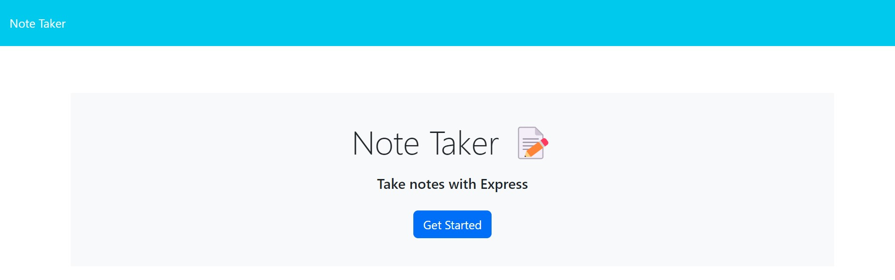

# Note Taker

## Description

This application lets the user submit notes that it saves for later viewing.

## Table of Contents

- [Installation](#installation)
- [Usage](#usage)
- [Credits](#credits)
- [License](#license)
- [Features](#features)
- [Contributions](#contributions)
- [Tests](#tests)
- [Questions](#questions)
- [Screenshot](#screenshot)

## Installation

This application does not have any dependencies for use.

## Usage

First the user presses tge "Get Started" button on the home page. They are then taken to the notes page; if the user has notes saved already they will be displayed on the left side of the site. They only need to click on the note they wish to view and will be appended to the page. If the user wants to make a new note they need to hit the "New Note" button in the top right corner of the page, they will then need to enter the note title and note content. Once both have been entered they only need to hit the "Save Note" button in hte top tight corner of the screen where the "New Note" button was located.

## Credits

My instructor LEif for teaching me all the concepts and skills required to create this application.

## License

This project uses the [MIT](https://choosealicense.com/licenses/mit/) License.

---

## Features

Express NPM Package

## Contributions

It uses the Express NPM PAckage. 

Also see [Contributor Covenant](https://www.contributor-covenant.org/).

## Tests

N/A

## Questions

If you have any questions or concerns reach out to me via one of the following: 

GitHub: [xWhoKnowz](https://github.com/xWhoKnowz) 
Email: TBD

## Webpage Screenshot
    
